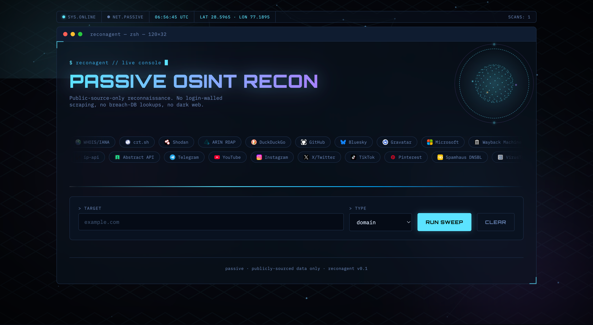
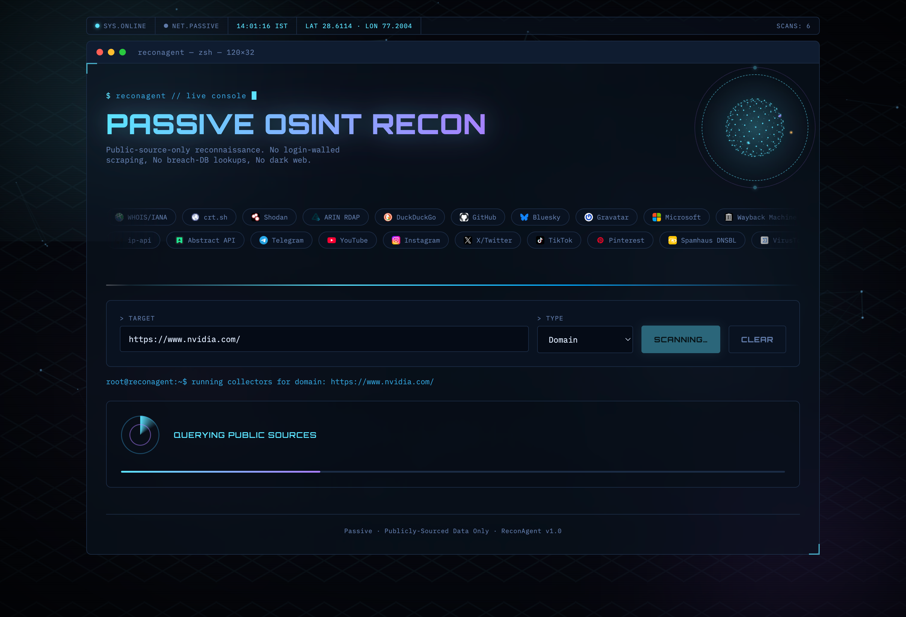
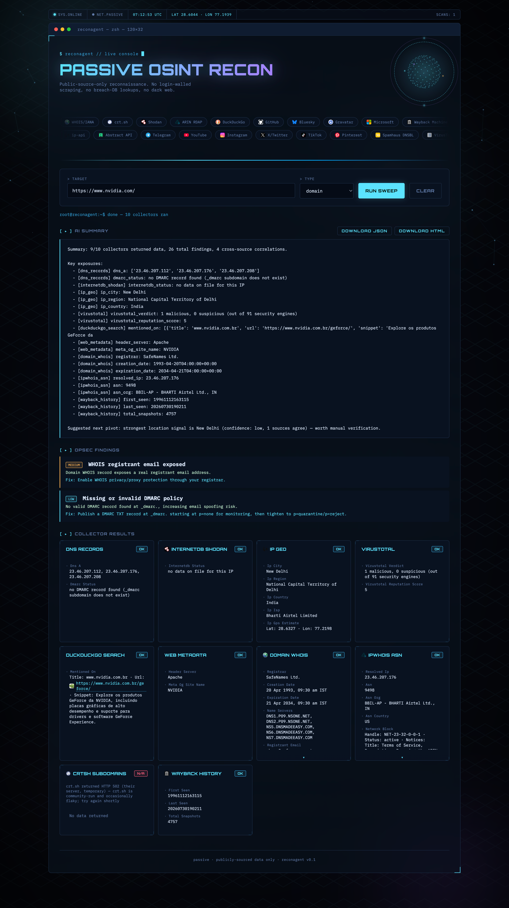

# ReconAgent - Passive OSINT Recon Framework

[](LICENSE)
[](pyproject.toml)


<div align="center">
  <br><br>
  <br><br>
  
</div>

Automated reconnaissance tool that aggregates **public, passive-only** data
across domain, username, email, phone, and file-metadata vectors. It
cross-correlates findings for higher-confidence signal (location clustering
is one example), flags what the target is unknowingly exposing through an
OPSEC layer, and generates an LLM-summarized recon report.

Companion project to an LLM Prompt Injection & Red-Team Testing Framework
(not yet published, link will be added here once it's live). Both projects
share the same modular plugin architecture and the same honesty-over-
certainty detection philosophy, just applied to OSINT instead of
adversarial LLM testing.

## What makes this "not a toy"

- **26 real collectors** across domain, username, email, phone, image, and
  PDF targets. Most are free with no key required; a handful are optional-key
  (VirusTotal, Abstract Phone Intelligence, Telegram Bot API). Every source
  is genuinely free and currently working, backed by a real public API or
  offline library, verified as of July 2026 (see `docs/SOURCES.md` for the
  full audit, including sources that got deliberately excluded and why.
  OpenCorporates, for example, turned out to require a paid plan after being
  wrongly assumed free, and was removed).
- **Passive only.** No login-wall scraping, no breach-DB credential lookups,
  no dark-web access. Every source here is one an unauthenticated visitor
  or a public API could reach. This is a deliberate legal and ethical
  boundary, not a limitation of what was technically possible to build.
  See `docs/SCOPE.md`.
- **Cross-source correlation, not just data dumping.** `correlator.py`
  clusters agreeing signals (WHOIS country, IP geolocation, and phone region
  agreeing with each other, for instance) into a confidence-scored location
  estimate.
- **OPSEC framing.** Every finding that represents an exposure gets mapped
  to a remediation recommendation, turning this from a plain recon tool into
  defensive security tooling.
- **Security-hardened for public deployment.** Per-IP rate limiting, upload
  size caps, job-store expiry, and SSRF protection that blocks requests to
  private, internal, and cloud-metadata IP ranges. See `docs/SCOPE.md`.
- **LLM-agnostic summarizer.** Ollama (local) or Groq (API) generate a
  narrative summary and suggest a next pivot. It degrades gracefully to a
  deterministic template if no LLM backend is configured, so the tool never
  hard-fails.

## Web UI

A dark-console web UI (`webapp/`) wraps the same pipeline over FastAPI, so
you can run scans from a browser instead of the terminal. It supports
drag-drop image and PDF upload for EXIF and metadata analysis.

```bash
git clone <this-repo>
cd osint-recon-agent
python3 -m venv .venv
source .venv/bin/activate
pip install -e ".[web]"
cp .env.example .env   # optional, fill in keys for the optional-key collectors
uvicorn reconagent.web:app --reload
# open http://127.0.0.1:8000
```

### Optional API keys

All keyed collectors skip cleanly with a clear message if their key is
missing. Nothing crashes, you just get fewer findings for that source. Add
whichever you want to `.env` (never commit this file, it's already
gitignored):

```bash
ABSTRACTAPI_PHONE_KEY=...   # abstractapi.com - free, 100 req/month, no card
TELEGRAM_BOT_TOKEN=...      # message @BotFather on Telegram, /newbot - free, instant
VIRUSTOTAL_API_KEY=...      # virustotal.com/gui/join-us - free, 500 req/day, no card
GROQ_API_KEY=...            # console.groq.com - free tier, for --llm-backend groq
```

### Deploy free

**Render.com (recommended).** `render.yaml` is already included.
1. Push this repo to GitHub.
2. On render.com, go to New, then Blueprint, then connect the repo. It reads
   `render.yaml` automatically. Pick the free plan and deploy.
3. Add your env vars in Render's dashboard under the Environment tab, not in
   the repo itself.
4. The live URL will look something like
   `https://reconagent-web.onrender.com`.

Why not GitHub Pages or Vercel for the backend: GitHub Pages only serves
static files, no server-side code at all. Vercel's Python support is
serverless-function-only, with cold starts and short execution limits, and
this tool runs multi-second live network scans across many collectors in
parallel. That needs a real long-running process, which Render or Railway's
free tier actually gives you. You can still host a static landing page on
GitHub Pages or Vercel that links to the live Render backend if you want a
`yourname.github.io` or `yourname.vercel.app` URL to share.

**Railway** works the same way as Render if you prefer it. Just take the
same buildCommand and startCommand from `render.yaml` and paste them into
Railway's service settings.

## Quickstart (CLI)

```bash
pip install -e .
reconagent list-collectors
reconagent run --target example.com --type domain --out report --format html --format json
reconagent run --target octocat --type username --out report
```

## AI/ML enrichment (real techniques, not LLM-summary buzzwords)

- **NER-based PII extraction** (spaCy). Pulls names, orgs, locations,
  phones, and emails out of bios and OCR'd text automatically.
- **Avatar image-similarity matching** (perceptual hashing). Flags when two
  different accounts use the same profile photo, a real cross-platform
  identity signal independent of usernames.
- **OCR text extraction** (Tesseract, with real image preprocessing). Turns
  uploaded screenshots, documents, and business cards into searchable text,
  which then feeds into PII extraction.
- **Stylometric writing-style comparison** (classical NLP). A soft signal
  comparing bio writing patterns across accounts.
- **Fuzzy correlation** (rapidfuzz). Catches location and entity matches
  that exact-string comparison misses.

Honestly, only one of these (spaCy NER) is genuine machine learning. The
rest are real, valuable classical algorithms: signal processing, string
similarity, feature engineering. They're not "AI" in the trained-model
sense, and they're labeled accurately here rather than oversold. A
face-detection module was actually built at one point, and fixed through a
real OpenCV 5.0 API-removal bug, then deliberately removed after concluding
it added no value for this tool's single-image-upload interface (see
`docs/SOURCES.md` for the full reasoning).

## Architecture

```
Collector layer (26 pluggable modules, one per source)
        |
        v
Aggregator (parallel run, per-collector fault isolation, timeouts)
        |
        v
Correlator (cross-source agreement -> confidence-scored location clusters)
        |
        v
OPSEC layer (finding -> exposure title + severity + remediation)
        |
        v
LLM summarizer (Ollama/Groq/template fallback)
        |
        v
Reporting (JSON + dark-themed HTML report, or the web UI)
```

See `docs/ARCHITECTURE.md` for the full design doc.

## Scope and legal boundary

This tool intentionally does not implement dark-web scraping, breach-DB
credential lookups without an authorized paid API, login-walled social
scraping, or people-search-broker aggregation. These aren't missing
features. They're a documented boundary. See `docs/SCOPE.md`.

## Documentation

- `docs/ARCHITECTURE.md`: full design doc and rationale for key decisions
- `docs/SOURCES.md`: audit of every data source, verified-free status, and
  what was deliberately excluded and why
- `docs/SCOPE.md`: the legal and ethical boundary this tool holds, explained

## License

MIT. See LICENSE.